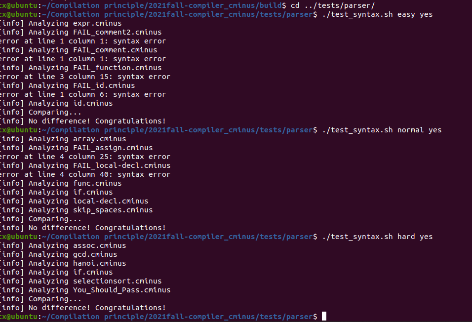

# lab1 实验报告
学号 PB19111733	姓名 陈鑫

## 实验要求

1. 认识Cminus-f语言的词法，并根据文档和代码注释完成词法的正则表达式。
2. 阅读文档中Cminus-f的语法，在代码中填写相应的规则，以保证最后生成一颗正确的语法树。
3. 完成编译运行，最终通过测试。

## 实验难点

个人在实验过程中发现以下几个部分比较困难：

1. 部分词法的正则表达式的构建，比如回车(\n)，注释(/*  */)，浮点数，尤其是注释，相对比较难。
2.  文法规则的补写，最开始不是很理解代码的格式，在网上查了一些Bision的知识，并结合代码样例成功完成了文法规则。

## 实验设计

大体分为两个部分：

* **补全词法分析，识别出token，text等内容**

  1. \> = \>= + - \* / 等运算符号的正则表达式比较简单，在前面加一个 \ 即可。例：

     `\<\= {pos_start=pos_end; pos_end+=2; pass_node(yytext); return LToE; }`

  2. else int等关键字直接输入即可，例：

     `else {pos_start=pos_end; pos_end+=4; pass_node(yytext); return ELSE;}`

  3. 整数 变量名 浮点数的正则表达式，在Basics.md文件中有说明。

     ```
     [0-9]+ {pos_start=pos_end; pos_end+=strlen(yytext); pass_node(yytext); return NUM;}
     [a-zA-Z]+ {pos_start=pos_end; pos_end+=strlen(yytext); pass_node(yytext); return ID;}
     ([0-9]+\.|[0-9]*\.[0-9]+) {pos_start=pos_end; pos_end+=strlen(yytext); pass_node(yytext); return FLOATNUM;}
     ```
     
  4. 对于空格，回车这些不需要返回，记录下line即可。

     ```
     \n {lines+=1;}
     \r {}
     \t {pos_start=pos_end; pos_end+=4;}
     ```

  5. 注释的正则表达式有一些麻烦，但是可以通过识别*/来判断一段注释，识别到/\*后读取后续的字符，匹配到\*/即可结束。

     ```
     \/\* {
               pos_start=pos_end; 
               int state=0;
               a='1';
               while(a&&state!=2)
               {
                    a=input();
                    if(a=='\n')
                    {
                         pos_end+=1;
                         lines+=1;
                    }
                    if(a=='*')
                    {
                         state=1;
                    }
                    else if(a=='/' && state==1)
                    {
                         state=2;
                    }     
                    else
                    {
                         state=0;
                    }
               }
          }
     ```

     

* **补充文法规则**

  这部分较为简单，根据之前的词法一个个定义token以及之后用到的指令；然后根据Basics.md文件提供的规则写入即可，这部分在理解代码作用后就相对简单。

  ```
  //定义
  %token <node> ID
  //规则
  declaration-list: declaration-list declaration {$$=node("declaration-list", 2, $1, $2);}
                  | declaration {$$=node("declaration-list", 1, $1);}
                  ;
  ```

  

  

## 实验结果验证

代码编译运行，通过了测试。



## 实验反馈

本次实验难度适中，很好的巩固了之前学习的知识，而且通过实验文档可以很好的了解实验。但是最文档规则部分的解释个人理解起来有些困难，最后是结合网上相关文章理解了文档的意思，但是实验总体上设置的挺好的，通过实验我收获许多。

